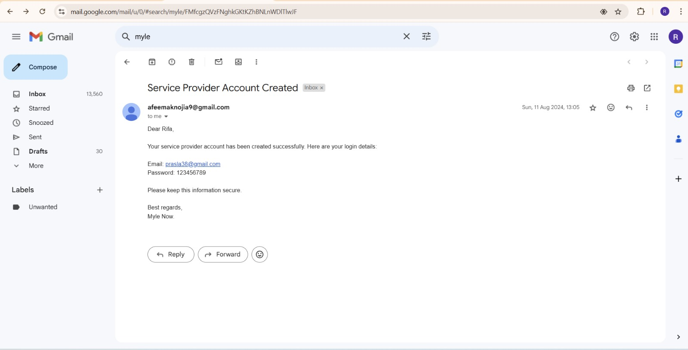

Developed a user-friendly website called "Mylenow” using MERN stack. Here, customers can effortlessly access a variety of home and beauty services, all from the comfort of their own home. Our mission is to connect them with skilled professionals who excel in tasks ranging from cleaning and repairs to beauty treatments.
On our platform, customers have the flexibility to browse through our extensive list of services like cleaning, haircut, spa treatments etc. and select exactly what they need with just a few clicks! Plus, they can conveniently book appointments according to their preferred time slot, ensuring that everything fits seamlessly into their schedule. Our aim is to streamline customers’ life, providing ultimate convenience while allowing them to sit back and relax while the experts take care of the rest.
Features like finding services, scheduling appointments and secure payments will transform the way people book and connect with service providers.
Users can easily sign up and log in securely. They'll discover a wide array of services listed, from cleaning to haircuts, each with detailed information and pricing. Booking a service is very easy - just choose a date, time, and we will pick the right professional for the job. Payments are straight-forward. Service providers can view the orders received in their field of expertise and accept the orders that fit their schedule. Our admin dashboard can create profiles, update services and ensures smooth operation, handling user management and issues. Whether you're booking a service or offering one, our platform will simplify the process.
This project is exciting because it helps people in two big ways: For customers, it means they can book any service without leaving their house, saving their time and inconvenience. It will benefit customers who may have difficulty accessing traditional service providers due to mobility issues, or other constraints. And for professionals, it opens new opportunities for them to find work, show skills and grow their businesses. It's a win-win situation for everyone involved!

To run the project locally:

1) Use the github link and download the zip file.
2) Unzip the folder and open it in your favorite code editor.
3) In the code editor, open 2 terminals. One for UI and and other for backend.
4)For UI, type “npm start”.
5)For backend, navigate to the backend folder (cd backend) and the type “node server.js”.
6)Project will open automatically in browser and you can start exploring.

Website Features:
1)	Home Page

2)Register/Login with Email verification.

3)	Search for the service you are looking for.

4)	Explore all services using categories and sub categories on service page.

 
5)View Product details and steps involved in service.

 

6)Add service to cart and view the summary.

7) Proceed to checkout and select your preferred date and time.

8)Make secured payment with stripe.

9) Payment Done!

Now, lets look at some admin features.
1)Admin can add, edit, delete services.

2)Admin can add new service providers and create a password for service providers that will be associated to their account. Once service provider is added, a confirmation email will be sent to them with their passwords which will be used for login.

